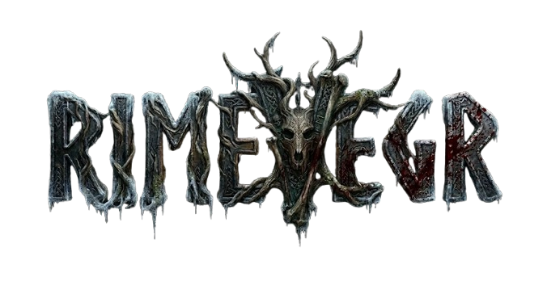
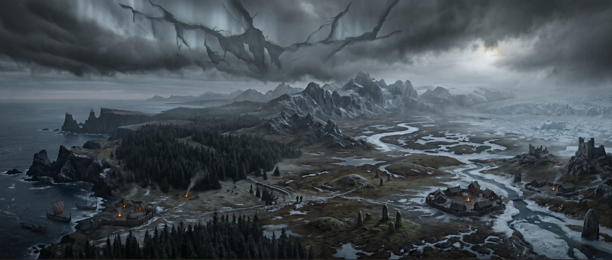

<p align="center">
  
</p>

# Rimevegr — Dark Norse Campaign Setting

> *A world drowning in perpetual twilight, rime-fog, and the long cold. The gods
> are silent but their absence is felt in every empty sky. Life is short,
> measured by the ledger, the axe, and the fire. Glory is a lie the dead tell
> themselves.*



Imagine a world where the sun died centuries ago and nobody noticed.

Not in fire. Not in glory. It simply — dimmed. One harvest the sky was a
grey-white lid, and it never lifted. The crack that let the Veil through runs
from the northern ice all the way down the spine of the world, and the gods,
if they ever listened, do not listen now. Their silence is the oldest
certainty. Harder than iron. Colder than the ground in the month the locals
call Hungers-End, which is the month that never actually ends.

This is the Rimevegr. The Frost Road. A thousand miles of frozen marsh,
black pine, and the ruins of what was once a half-believable world. The
people who live here call themselves by old names — Raumsdalers,
Halogalanders — but the names have frayed. They are survivors first, and
everything else a distant second. They do not sing about glory. They count
it in silver, in stores of dried fish, in the number of men who limped home
from a contract instead of feeding the crows.

You are not a hero. You are a hired blade in a land that has no use for
heroes. The old sagas spoke of men who defied the jarls, sailed the serpent
sea, and died with a sword in hand and a poem on their lips. Those sagas
were written by people who had never stood watch in a Rimevegr winter,
never watched a friend's breath frost over for the last time because the
camp ran out of firewood three days before the supply sledge arrived. The
truth is not poetic. The truth is that a man with an axe, a full belly, and
a band that trusts him can survive one more season. That is the only glory
worth having.

The Rimevegr does not hate you. It is not malevolent. It is simply
indifferent in a way that makes hatred feel almost nostalgic. The Veil
squats overhead, a perpetual overcast that bleeds the colour out of
everything — greys and browns and the faded white of rime on stone. The
wind comes down from the ice in long, patient gusts that find every gap in
your cloak. The ground is hard, the days are short, and the nights are
long enough to remember every mistake you ever made.

And yet. People endure. They build halls in the lee of hills, name their
children after grandparents who died in bed (a small miracle here), and
spend the brief damp summer cutting hay that will not quite last the
winter. They make oaths on silver and honour them because a broken oath
spreads faster than fever in a village of thirty souls. They pay their
dead into the earth with their tools and their weapons, because the
barrows hold more than bones, and every farmer knows it.

You will walk into a settlement called Skurwegr — Wolf's-Water — and find
twenty-eight souls living in the shadow of a barrow that leaks something
akin to memory on certain nights. You will stand in the hall of a jarl who
rules because he can feed his people, not because his bloodline is old. You
will watch a volva read the weave of a man's fate in the patterns of thrown
bones, and you will not know whether what she saw was true or whether the
true and the useful have, in this place, become the same thing.

Magic, when it comes, comes at a cost. The runescribe cuts his arm to make
the marks hold. The spirit-walker returns from the grey with a piece of
herself missing. The wyrd-reader sees the shape of what is to come, and
the seeing changes her, bends her, ages her in ways that have nothing to do
with years. This is not a world of fireballs and cantrips. It is a world
where a man might trade a year of his life for a single true glimpse of
what waits beyond the next ridge, and count himself lucky to have made the
bargain.

The band is your world. Fourteen souls, give or take. A captain whose
decisions you trust with your life because you have no choice. A
second-in-command who remembers whose turn it is to stand the midnight watch
when the rime-fog rolls in and visibility drops to the length of a spear.
A cook who can make dried cod taste like something other than penance. A
quartermaster who counts every arrow, every nail, every strip of jerky as
though it were his own blood, because in a real way it is. You will argue
over shares, over who drew the easy watch, over whether to accept a
contract that pays well but smells wrong. You will stand shoulder to
shoulder in a shield wall against men who want the same silver you want,
and you will learn their names. Some of them will survive the year. Most
will not.

The contracts are simple on the surface: protect this village, patrol this
valley, carry this message through the pass, clear this barrow of whatever
has been scratching at the door from the inside. But every contract has a
second layer — the thing the hirer did not say, the cost they did not
mention, the winter that will come early and trap you on the wrong side of
the mountains with a wounded man and half the supplies you need. The
ledger does not lie. If the numbers do not work, you starve. If the oaths
do not hold, you die. If the weather turns, you die anyway, but slower.

The world beyond the Rimevegr still exists — or so the traders say.
Kingdoms to the south where the sun still shows itself, where the harvest
fills the granaries, where men build in stone and argue about the will of
gods who still answer. But those kingdoms are stories. The Rimevegr is
what is real. The Rimevegr is what you have. The Rimevegr is what will
take everything you have and leave your bones in a shallow grave marked
only by a cairn of stones that travellers will add to, out of habit, until
the pile is as tall as a man and nobody remembers whose bones lie beneath.

This is the setting you are about to enter. It is not kind. It does not
care about your character's backstory. It will test every decision you
make, every alliance you forge, every piece of silver you spend. The story
of the Rimevegr is not about winning. It is about enduring — and the
choices you make while the world grinds you down.

Welcome to the Frost Road. Make your peace with the cold.

---

## At a Glance

| Aspect | |
|---|---|
| **Era** | ~850–1050 CE Norse world, collapsed into eternal twilight |
| **Magic** | Low, costly, terrifying — galdr runes, seiðr spirits, wyrd-reading |
| **Tone** | Authentic early-medieval grit, economic pressure, grounded dread |
| **Focus** | Mercenary survival — contracts, supply, weather, loyalty, debt |
| **Inspiration** | Viking Age Scandinavia, *The Northman*, *The Last Kingdom* (grit), *Valhalla* (tone) |

## What's Inside

| Module | Description |
|---|---|
| **📖 Setting Bible** | Complete world lore: geography, culture, economy, religion, calendar, weather, and magic system |
| **⚔️ Simulation Rules** | Iron Ledger custom game system — combat, travel, logistics, morale, recruitment, wounds, and band management |
| **🗺️ Living World Data** | Settlement economies, bestiary, contracts, weather engine, political state, and NPC tracking in structured YAML |
| **🐍 Python Engine** | Scripts for combat resolution, logistics, weather, morale, NPC generation, economy simulation, and campaign journaling |
| **📜 Campaign Content** | Five plot arcs spanning Y311–Y315, 41 narrative vignettes, barrow dungeons, rival factions, and named NPCs |
| **🎲 RP & Writing Modes** | Player-facing roleplaying prompt for interactive play, plus novel-writing mode for fiction authors |
| **🗺️ Hex Map Tool** | Interactive geographic explorer for the frozen villages, barrows, and routes of the Rimevegr |

## Quick Start

### For Game Masters

1. Read `01_RIMEVEGR_SETTING_BIBLE.md` for world context.
2. Load `00_ROLEPLAYING_PROMPT.md` as your player-facing game prompt.
3. Use `20_SIMULATION_RULES.md` for combat, travel, and economy resolution.
4. Run Python scripts in `scripts/` to simulate encounters, weather, and band logistics.

### For Writers

1. Read `01_RIMEVEGR_SETTING_BIBLE.md` for world context.
2. Load `00_NOVEL_WRITING_PROMPT.md` as your authoring guide.
3. Reference numbered documents (01–24) as your world database.
4. Use `24_VIGNETTES_AND_SCENES.md` for tone and narrative examples.

### For Developers

```bash
pip install -r scripts/requirements.txt
python scripts/engine.py --help
python scripts/combat_sim.py --help
python scripts/ledger.py --help
```

Run tests with:

```bash
pytest tests/
```

## Document Map

| File | Content |
|---|---|
| `01_RIMEVEGR_SETTING_BIBLE.md` | Core world lore, tone, and setting foundations |
| `03_GEOGRAPHY_AND_MAP.md` | Regions, landmarks, travel distances |
| `04_CULTURE_AND_CUSTOMS.md` | Daily life, laws, social structure |
| `05_ECONOMY_OF_RIMEVEGR.md` | Currency, trade routes, costs, services |
| `07_RELIGION_OF_RIMEVEGR.md` | Pantheon, cult practices, divine silence |
| `08_MAGIC_OF_RIMEVEGR.md` | Galdr, seiðr, wyrd-reading, magic system |
| `09_WEATHER_SEASONS_AND_HAZARDS.md` | Climate, environmental rules |
| `10_CALENDAR_AND_HIDDEN_EVENTS.md` | Timeline, seasonal events, hidden engine |
| `11_VILLAGES_AND_SETTLEMENTS.md` | Settlement data and economies |
| `13_RIVAL_BANDS_AND_FACTIONS.md` | Opposition forces, political factions |
| `18_BARROWS_OF_RIMEVEGR.md` | Burial sites, dungeon encounters |
| `20_SIMULATION_RULES.md` | Complete Iron Ledger game system |
| `23_CAMPAIGN_ARCS_AND_PLOT_SEEDS.md` | Y311–Y315 story arcs |
| `24_VIGNETTES_AND_SCENES.md` | 41 narrative vignettes for tone and inspiration |

## License

This project is published as a public campaign setting. See individual source
files for author attribution. All original content is released under the terms
specified in the repository.

---

<p align="center">
  <sub>Built with the Iron Ledger simulation engine — mercenary survival in the
  long cold.</sub>
</p>
